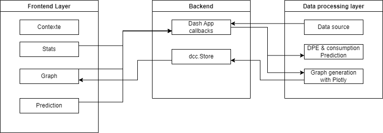
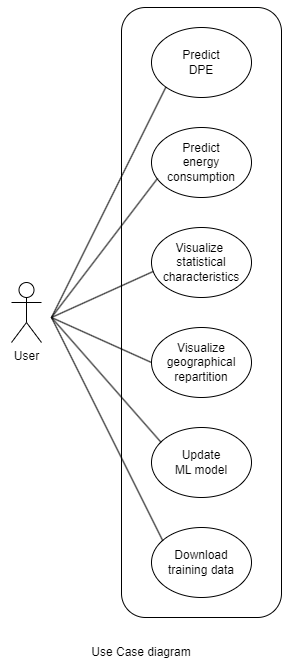
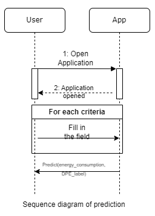

# Project Dependencies Documentation

## Diagrams
### Architecture diagram


### Use case diagram


### Sequence diagram for predicting energy consumption and DPE


# Steps to Install and Run the App Locally

To get started with the app locally, please follow these steps.

### 1. Install Python
   - This application requires Python 3.11.10.
   - You can download Python from the [official Python website](https://www.python.org/downloads/).
   - Verify the installation by running:
     ```bash
     python --version
     ```

### 2. Clone the repository
   - Clone the repo in the folder of your choice
     ```bash
     git clone <repo_URL>
     ```

### 3. Set Up a Virtual Environment (Optional but Recommended)
   - Virtual environments help keep dependencies isolated.
   - To create a virtual environment, run:
     ```bash
     python -m venv venv
     ```
   - Activate the virtual environment:
     - On **Windows**:
       ```bash
       .\venv\Scripts\activate
       ```
     - On **macOS/Linux**:
       ```bash
       source venv/bin/activate
       ```

### 4. Install Dash and Required Dependencies
   - Use `pip` to install all dependencies needed for the app with requirements.txt.
   
     ```bash
     pip install -r requirements.txt
     ```

### 5. Run the App
   - Run the app by executing:
     ```bash
     python main.py
     ```
   - Then, open a web browser and go to `http://127.0.0.1:8050` to view your app.


## Dependencies

### 1. [dash](https://dash.plotly.com/)
   - **Description**: Dash is a Python framework developed by Plotly to create interactive web applications and data visualization dashboards  with minimal to no JavaScript.
   - **Features**:
     - Supports reactive components to update visualizations and UI based on user inputs.
     - Integrates with Plotly.
     - Allows for seamless web deployment using Flask.

---

### 2. [dash-html-components](https://github.com/plotly/dash-html-components)
   - **Description**: An extension to Dash functionnalities. This package provides HTML components for Dash apps, allowing developers to use standard HTML elements (like <div>, <button>, <input>) as Python classes.
   - **Features**:
     - Simplifies the layout and styling of Dash applications.
     - Enables Pythonic syntax for HTML elements.

---

### 3. [dash-core-components](https://github.com/plotly/dash-core-components)
   - **Description**: Another extension to Dash functionnalities, offers core components for Dash, such as graphs, sliders, dropdowns, and date pickers.
   - **Features**:
     - Contains interactive elements crucial for data exploration (e.g., dcc.Graph, dcc.Slider).
     - Integrates directly with Dash callbacks for dynamic data visualization.

---

### 4. [dash-table](https://dash.plotly.com/datatable)
   - **Description**: A Dash component for creating interactive tables, allowing for the display, filtering, and editing of data within a table format.
   - **Features**:
     - Supports pagination, sorting, and editable cells.
     - Can handle large datasets and integrates with Dash callbacks.

---

### 5. [gunicorn](https://gunicorn.org/)
   - **Description**: Gunicorn is a Python WSGI HTTP Server for UNIX, commonly used to serve Python web applications, including Flask and Dash.
   - **Features**:
     - Supports multiple workers for handling concurrent requests.
     - Easy to configure and manage, with settings for performance tuning.

---

### 6. [pandas](https://pandas.pydata.org/)
   - **Description**: Pandas is a powerful data manipulation and analysis library for Python. It provides data structures such as DataFrames, making it easy to work with structured data.
   - **Features**:
     - High-performance, memory-efficient data handling.
     - Offers functions for data wrangling, including merging, grouping, reshaping, and time-series data analysis.

---

### 7. [plotly](https://plotly.com/python/)
   - **Description**: Plotly is a graphing library for creating interactive, web-based visualizations. It integrates with Dash for building web applications.
   - **Features**:
     - Supports a wide range of charts, from basic line and bar plots to complex 3D and geospatial plots.
     - Generates interactive visualizations that can be exported to HTML or integrated with Dash.

---

### 8. [requests](https://docs.python-requests.org/en/latest/)
   - **Description**: Requests is a simple and elegant HTTP library for Python, widely used for making HTTP requests to APIs.
   - **Features**:
     - Simplifies HTTP methods (GET, POST, etc.) with easy syntax.
     - Supports session management, cookies, headers, and authentication.

---

### 9. [tqdm](https://tqdm.github.io/)
   - **Description**: Tqdm provides fast, extensible progress bars for loops and asynchronous tasks.
   - **Features**:
     - Integrates easily with Python loops, Pandas, and even Jupyter notebooks.
     - Customizable appearance and multi-threading support.

---

### 10. [joblib](https://joblib.readthedocs.io/en/latest/)
   - **Description**: Joblib is a library for parallel processing in Python, commonly used for caching and running tasks in parallel.
   - **Features**:
     - Supports multiprocessing, efficient disk storage, and fast in-memory caching.
     - Lightweight and often integrated with scikit-learn for parallelizing machine learning tasks.

---

### 11. [numpy](https://numpy.org/)
   - **Description**: NumPy is a fundamental package for numerical computation in Python, providing support for arrays, matrices, and high-level mathematical functions.
   - **Features**:
     - Offers n-dimensional array objects, powerful numerical operations, and linear algebra functions.
     - Optimized for high performance in scientific computing.

---

### 12. [pyproj](https://pyproj4.github.io/pyproj/)
   - **Description**: Pyproj is a Python interface to PROJ, a library for cartographic transformations and geospatial projections.
   - **Features**:
     - Supports transformations between coordinate systems and geographic projections.
     - Works with geospatial libraries like GeoPandas and Shapely.

---

### 13. [scikit-learn](https://scikit-learn.org/)
   - **Description**: Scikit-learn is a popular machine learning library for Python. It includes a wide range of algorithms for classification, regression, clustering, and more.
   - **Features**:
     - Provides simple and efficient tools for predictive data analysis, including pre-processing, feature selection, and model evaluation.
     - Integrates with other data science libraries like Pandas, NumPy, and Joblib.

---

### 14. [Kaleido](https://github.com/plotly/Kaleido): A Cross-Platform Static Image Exporter for Plotly

 - **Description**: Kaleido is a powerful and efficient static image export engine for Plotly. It provides a seamless way to export Plotly figures as images (PNG, JPEG, WebP, SVG, PDF, and EPS) without requiring a browser, making it ideal for server-side environments or when you need to save static images programmatically.

- **Features**:
    - Works on all major platforms (Linux, macOS, and Windows).
    - Unlike orca, Kaleido doesn't need a running browser or an external service to export Plotly figures to images.
    - Built for performance, enabling quick image generation even for complex plots.
    - Export your plots to PNG, JPEG, WebP, SVG, PDF, and EPS formats.
    - Works directly with Plotly via its Python API.
